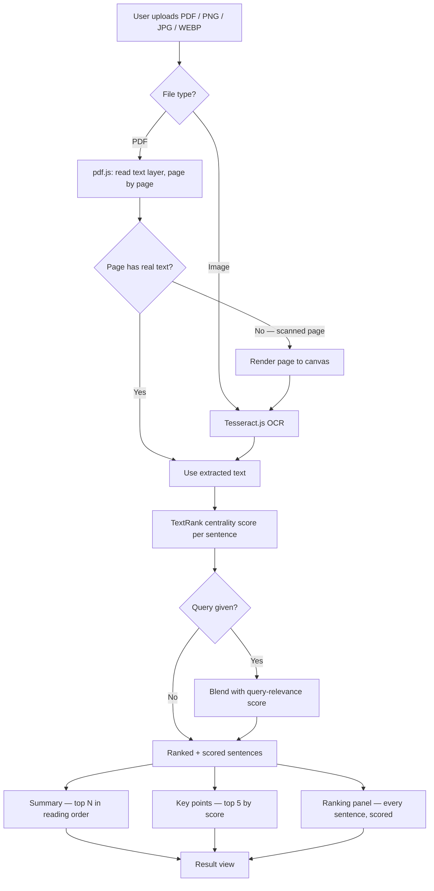

# Document Summary Assistant

Upload a PDF or a scanned image and get a smart, adjustable-length summary
with the most important sentences highlighted as key points — extraction,
OCR, and summarization all run **entirely in your browser**, with **zero
external network dependency** at runtime. Nothing is uploaded to a server,
and nothing is fetched from a third-party CDN either.

[](https://github.com/HrishiKoushalb/document-summary-assistant/actions/workflows/ci.yml)

**Live demo:** [hrishi-document-summary-assistant.vercel.app](https://hrishi-document-summary-assistant.vercel.app/)

<p align="center">
  
</p>

<p align="center">
  
</p>

<details>
<summary>More screenshots (scanned-image OCR, mobile)</summary>
<br>
<p align="center">
  
</p>
<p align="center">
  
</p>
</details>

---

## Features

- **Upload** — drag-and-drop or file picker, for PDF, PNG, JPG, and WEBP
- **Text extraction** — reads the embedded text layer of a PDF page by page
- **Automatic OCR fallback** — if a PDF page has no usable text layer (i.e.
  it's a scanned/photographed page), that page is rendered to a canvas and
  run through [Tesseract.js](https://tesseract.projectnaptha.com/) OCR
  automatically. Plain image uploads always go through OCR.
- **Smart summarization** — an unsupervised, graph-based extractive
  algorithm ([TextRank](https://web.eecs.umich.edu/~mihalcea/papers/mihalcea.emnlp04.pdf))
  ranks every sentence by how central it is to the document, with **no
  external API calls**
- **Adjustable length** — Short / Medium / Long, recomputed instantly
  (no re-extraction needed)
- **Query-focused summarization** — an optional "Focus on…" field steers
  which sentences get pulled in, e.g. "pricing" or "security risks" on the
  same document, recomputed instantly from the cached text
- **Key points** — the top-ranked sentences, surfaced separately as
  scannable highlights
- **Ranking transparency** — a "How this was ranked" panel shows every
  candidate sentence with its score and whether it made the cut, so the
  algorithm isn't a black box
- **Installable / offline-capable (PWA)** — after the first visit, the app,
  the OCR engine, and the language model are all cached locally; it opens
  and works with no network at all
- **Loading states & error handling** — clear progress feedback during
  extraction/OCR, and specific error messages for unsupported files,
  oversized files, and documents with no readable text
- **Mobile responsive**
- **Automated tests** — unit tests for the summarization engine (`npm test`),
  run on every push via GitHub Actions

## Architecture



Everything left of the summarizer runs in the main thread or a Web Worker
inside the user's browser — there is no backend and no API layer. Changing
the length or the query re-runs only the summarizer against the already-
extracted text, not the extraction/OCR step.

## Why no AI/LLM API?

I went with a client-side, algorithmic approach (TextRank) instead of
calling a hosted LLM:

1. **Privacy** — documents never leave the user's device. For a document
   summarizer, that's a meaningful default, not just a nice-to-have.
2. **Reliability** — no API keys to manage, no rate limits, no dependency
   on a third-party service being up. The demo behaves identically on the
   1st request and the 10,000th.
3. **Zero backend** — the whole app is a static site, trivial to deploy
   for free with no `.env` or secrets involved.

The tradeoff: this produces an **extractive** summary (the best original
sentences, verbatim) rather than a fluently rewritten abstract. For a
document-comprehension tool, faithfulness to the source felt like the
right thing to optimize for. Swapping in a hosted summarization API later
is a contained change — see `src/lib/summarizer.js`.

## Query-focused summarization and ranking transparency

Plain TextRank answers "what's central to this document?" — useful, but
not the same question as "what does this document say about X?" The
optional query field answers the second question by reusing the same
word-overlap similarity function TextRank already uses for sentence-to-
sentence comparison, just pointed at the query instead: each sentence
gets a query-relevance score the same way it gets a centrality score, and
the two are blended (0.65 toward the query, since typing one is a
deliberate signal — see the comment above `QUERY_WEIGHT` in
`summarizer.js` for the full reasoning). An empty query is a no-op: the
ranking math takes the same path as before this feature existed, which
is also what the "byte-identical with no query" test in
`summarizer.test.js` checks for directly.

The ranking panel exists because an extractive summarizer's whole pitch
is "faithful to the source" — but that's only a trustworthy claim if you
can see the ranking that produced it. Every candidate sentence and its
score gets returned from `summarize()`, not just the ones that made the
cut.

## Fully self-hosted OCR (no CDN dependency)

By default, Tesseract.js fetches its worker script, its WASM engine, and
its English language model from public CDNs at runtime. That's a hidden
external dependency most people never think to remove — if the CDN is
blocked (corporate proxy, ad-blocker, an outage), OCR silently breaks.

This project bundles all three locally under `public/tesseract/`
(worker script, WASM core, and the English `traineddata` model — see
`src/lib/ocrExtractor.js`), so OCR works from the same origin as the rest
of the app, with no runtime fetches to `cdn.jsdelivr.net` or anywhere else.

The same applied to the fonts: they were loading from Google Fonts at
runtime (a network dependency that's easy to miss, since it's just two
`<link>` tags), which would have made "works offline" a lie the moment
the browser needed a font it hadn't cached yet. `src/fonts.css` self-hosts
Newsreader, Inter, and IBM Plex Mono (latin + latin-ext subsets only —
the app is English-only, no need for the cyrillic/greek/vietnamese glyph
sets Google Fonts ships by default) under `public/fonts/`.

## Installable and offline (PWA)

With every runtime dependency already self-hosted, making the app a real
PWA was mostly wiring, not a new architecture: [`vite-plugin-pwa`](https://vite-pwa-org.netlify.app/)
generates the manifest and service worker at build time (a hand-rolled
service worker is easy to get subtly wrong on cache invalidation, so this
project doesn't try). The service worker precaches the entire app shell
*and* the self-hosted OCR engine, language model, and fonts — not just
HTML/CSS/JS — since those are exactly what would otherwise force a
network request the first time someone opens the app offline. Verified
directly, not just assumed from the config: the manifest and both icon
sizes resolve, the service worker registers and takes control of the
page, and — with the browser fully offline — the app not only loads but
successfully extracts and summarizes a real PDF.

## Tech stack

- **React 19 + Vite** — pure client-side SPA, no backend
- **Tailwind CSS v4** — custom design tokens (see `src/index.css`)
- **[pdfjs-dist](https://www.npmjs.com/package/pdfjs-dist)** — PDF text
  extraction and page rendering, via a real Web Worker
- **[tesseract.js](https://www.npmjs.com/package/tesseract.js)** — OCR,
  self-hosted (see above)
- **A from-scratch TextRank implementation** — `src/lib/summarizer.js`,
  no summarization library or API
- **[vite-plugin-pwa](https://vite-pwa-org.netlify.app/)** — manifest +
  service worker generation for offline/installable support
- **[Vitest](https://vitest.dev/)** — unit tests for the summarizer
- **GitHub Actions** — CI runs `npm test` and `npm run build` on every push

## Project structure

```
src/
├── App.jsx                    # top-level layout / state routing
├── fonts.css                  # self-hosted @font-face declarations
├── components/
│   ├── FileUpload.jsx         # drag-and-drop + file picker
│   ├── LengthControl.jsx      # Short/Medium/Long segmented control
│   ├── QueryControl.jsx       # "Focus on…" query input (debounced)
│   ├── ProcessingStatus.jsx   # loading state + progress bar
│   ├── ErrorBanner.jsx        # error state + retry
│   └── ResultView.jsx         # summary, key points, ranking panel, extracted text
├── hooks/
│   └── useDocumentProcessor.js # orchestrates extract -> summarize pipeline
└── lib/
    ├── pdfExtractor.js        # pdf.js text extraction + OCR fallback
    ├── ocrExtractor.js        # tesseract.js wrapper (self-hosted assets)
    ├── summarizer.js          # TextRank + query-relevance blending
    ├── summarizer.test.js     # unit tests (Vitest)
    └── polyfills.js           # feature-detected shims for a couple of very
                                # new JS built-ins pdf.js relies on
public/
├── tesseract/                 # self-hosted OCR worker, WASM core, English model
├── fonts/                     # self-hosted Newsreader/Inter/IBM Plex Mono
└── icons/                     # PWA manifest icons (192px, 512px)
.github/workflows/ci.yml       # test + build on every push
docs/                          # README screenshots
```

## Testing

```bash
npm test          # runs the Vitest suite once
npm run test:watch
```

The summarizer is tested for: sentence splitting (including abbreviations,
decimals, ellipses), the empty-input edge case, short-document passthrough,
length-tier ordering (short ≤ medium ≤ long), non-hallucination (every
summary sentence is verified to exist verbatim in the source), the key
points cap, the default-length behavior, the ranking panel's shape/order,
and the query feature — including the strict requirement that an empty
query produces byte-identical output to not passing one at all.

CI (`.github/workflows/ci.yml`) runs the full test suite and a production
build on every push to `main` and on every pull request.

## Running locally

Requires Node.js 18+.

```bash
npm install
npm run dev       # starts a dev server, prints a local URL
```

Build a production bundle:

```bash
npm run build      # outputs to dist/
npm run preview    # serve the production build locally to sanity-check it
```

## Deploying (free)

The app is a static site (no backend, no environment variables needed),
so any static host works.

### Option A — Vercel

1. Push this repo to GitHub.
2. Go to [vercel.com](https://vercel.com), "Add New Project," import the
   repo.
3. Framework preset: **Vite**. Build command `npm run build`, output
   directory `dist` (Vercel usually detects this automatically).
4. Deploy. You'll get a URL like `your-project.vercel.app`.

### Option B — Netlify

1. Push this repo to GitHub.
2. Go to [netlify.com](https://netlify.com), "Add new site" → "Import an
   existing project."
3. Build command: `npm run build`. Publish directory: `dist`.
4. Deploy.

Either way, no environment variables or secrets are required.

## Known limitations

- Extractive summaries can read slightly less "smooth" than an
  LLM-generated abstract, especially on documents that are themselves
  bulleted/structured rather than flowing prose — the algorithm picks the
  most representative *original* sentences rather than rewriting them.
- OCR accuracy depends on scan quality, as with any OCR engine.
- Very large PDFs (dozens of pages, mostly scanned) will take longer,
  since OCR runs per-page.
- Currently English-only for OCR (additional `@tesseract.js-data`
  language packages can be added the same way `eng` was — see
  "Fully self-hosted OCR" above).

## What I'd do with more time

- Add more `@tesseract.js-data` language packs and auto-detect language,
  or let the user pick one
- Persist recent summaries locally (IndexedDB) so a closed tab isn't a
  lost summary
- A feature-flagged "enhanced summary" mode that calls a hosted LLM for
  users who explicitly opt in and accept the privacy tradeoff, falling
  back to TextRank on failure
- Visual regression tests (e.g., Playwright + screenshot diffing) on top
  of the current unit tests
- A maskable PWA icon variant (the current icons work for the install
  criteria as-is, but a maskable version looks better on Android's
  adaptive-icon shapes)
