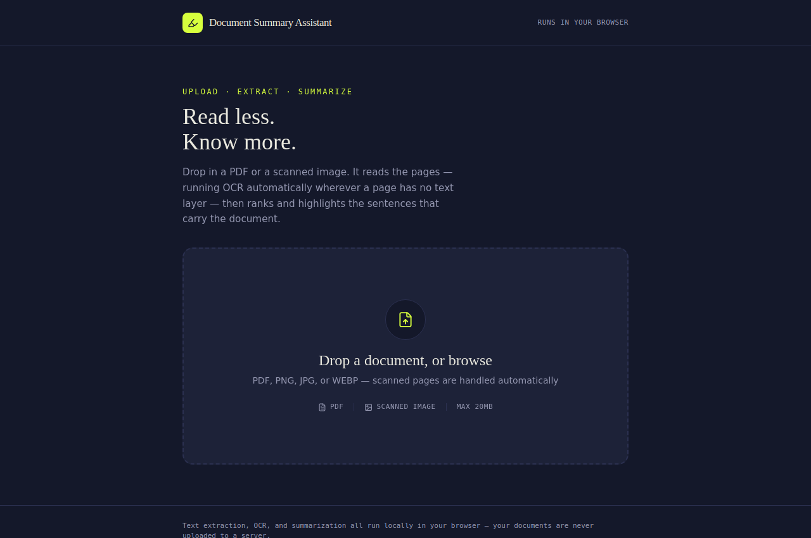
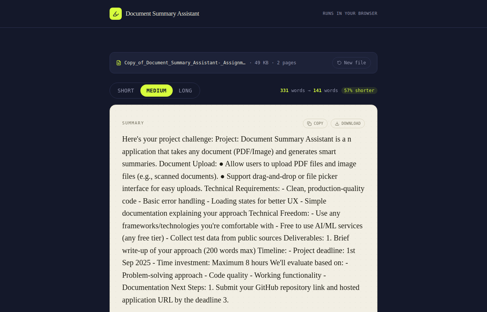
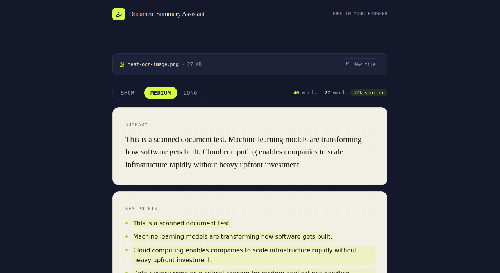
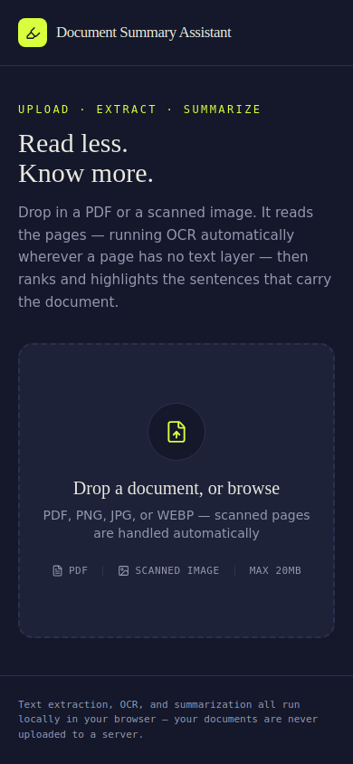
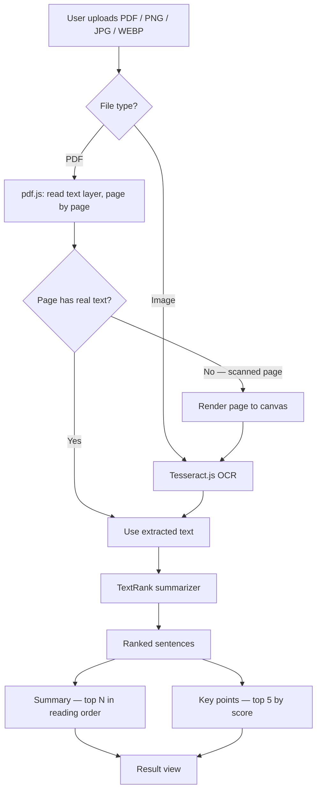

# Document Summary Assistant

Upload a PDF or a scanned image and get a smart, adjustable-length summary
with the most important sentences highlighted as key points — extraction,
OCR, and summarization all run **entirely in your browser**, with **zero
external network dependency** at runtime. Nothing is uploaded to a server,
and nothing is fetched from a third-party CDN either.

[](https://github.com/YOUR_USERNAME/YOUR_REPO/actions/workflows/ci.yml)

**Live demo:** _add your deployed URL here after following the deployment steps below_

<p align="center">
  
</p>

<p align="center">
  
</p>

<details>
<summary>More screenshots (scanned-image OCR, mobile)</summary>
<br>
<p align="center">
  
</p>
<p align="center">
  
</p>
</details>

---

## Features

- **Upload** — drag-and-drop or file picker, for PDF, PNG, JPG, and WEBP
- **Text extraction** — reads the embedded text layer of a PDF page by page
- **Automatic OCR fallback** — if a PDF page has no usable text layer (i.e.
  it's a scanned/photographed page), that page is rendered to a canvas and
  run through [Tesseract.js](https://tesseract.projectnaptha.com/) OCR
  automatically. Plain image uploads always go through OCR.
- **Smart summarization** — an unsupervised, graph-based extractive
  algorithm ([TextRank](https://web.eecs.umich.edu/~mihalcea/papers/mihalcea.emnlp04.pdf))
  ranks every sentence by how central it is to the document, with **no
  external API calls**
- **Adjustable length** — Short / Medium / Long, recomputed instantly
  (no re-extraction needed)
- **Key points** — the top-ranked sentences, surfaced separately as
  scannable highlights
- **Loading states & error handling** — clear progress feedback during
  extraction/OCR, and specific error messages for unsupported files,
  oversized files, and documents with no readable text
- **Mobile responsive**
- **Automated tests** — unit tests for the summarization engine (`npm test`),
  run on every push via GitHub Actions

## Architecture



Everything left of the summarizer runs in the main thread or a Web Worker
inside the user's browser — there is no backend and no API layer.

## Why no AI/LLM API?

The brief explicitly allows using a free-tier AI/ML service, and that was
seriously considered. I chose a client-side, algorithmic approach
(TextRank) instead, for a few concrete reasons:

1. **Privacy** — documents never leave the user's device. For a "document
   summarizer," that's a meaningful default, not just a nice-to-have.
2. **Reliability** — no API keys to manage, no rate limits, no dependency
   on a third-party service being up. The deployed demo behaves identically
   on the 1st request and the 10,000th.
3. **Zero backend** — the whole app is a static site, which makes it
   trivial to deploy for free and keeps the "no `.env`, no secrets"
   submission guideline trivially satisfied.

The tradeoff: this produces an **extractive** summary (the best original
sentences, verbatim) rather than a fluently rewritten abstract. For a
document-comprehension tool, faithfulness to the source felt like the
right thing to optimize for. Swapping in a hosted summarization API later
is a contained change — see `src/lib/summarizer.js`.

## Fully self-hosted OCR (no CDN dependency)

By default, Tesseract.js fetches its worker script, its WASM engine, and
its English language model from public CDNs at runtime. That's a hidden
external dependency most people never think to remove — if the CDN is
blocked (corporate proxy, ad-blocker, an outage), OCR silently breaks.

This project bundles all three locally under `public/tesseract/`
(worker script, WASM core, and the English `traineddata` model — see
`src/lib/ocrExtractor.js`), so OCR works from the same origin as the rest
of the app, with no runtime fetches to `cdn.jsdelivr.net` or anywhere else.

## Tech stack

- **React 19 + Vite** — pure client-side SPA, no backend
- **Tailwind CSS v4** — custom design tokens (see `src/index.css`)
- **[pdfjs-dist](https://www.npmjs.com/package/pdfjs-dist)** — PDF text
  extraction and page rendering
- **[tesseract.js](https://www.npmjs.com/package/tesseract.js)** — OCR,
  self-hosted (see above)
- **A from-scratch TextRank implementation** — `src/lib/summarizer.js`,
  no summarization library or API
- **[Vitest](https://vitest.dev/)** — unit tests for the summarizer
- **GitHub Actions** — CI runs `npm test` and `npm run build` on every push

## Project structure

```
src/
├── App.jsx                    # top-level layout / state routing
├── components/
│   ├── FileUpload.jsx         # drag-and-drop + file picker
│   ├── LengthControl.jsx      # Short/Medium/Long segmented control
│   ├── ProcessingStatus.jsx   # loading state + progress bar
│   ├── ErrorBanner.jsx        # error state + retry
│   └── ResultView.jsx         # summary, key points, extracted text
├── hooks/
│   └── useDocumentProcessor.js # orchestrates extract -> summarize pipeline
└── lib/
    ├── pdfExtractor.js        # pdf.js text extraction + OCR fallback
    ├── ocrExtractor.js        # tesseract.js wrapper (self-hosted assets)
    ├── summarizer.js          # TextRank implementation
    ├── summarizer.test.js     # unit tests (Vitest)
    ├── polyfills.js           # Uint8Array.toHex/fromBase64 polyfill (main thread)
    └── pdfWorkerEntry.js      # custom pdf.js worker entry (polyfills the worker thread too)
public/
└── tesseract/                 # self-hosted OCR worker, WASM core, English model
.github/workflows/ci.yml       # test + build on every push
docs/                          # README screenshots
```

### A note on `polyfills.js` / `pdfWorkerEntry.js`

`pdfjs-dist` v6 relies on the very new `Uint8Array.prototype.toHex` /
`fromBase64` methods. They're supported in current browsers, but to avoid a
confusing crash on anything slightly older, this project feature-detects
and polyfills them — **in both the main thread and inside pdf.js's own Web
Worker**, since a Worker has its own independent JS global scope. This is
the kind of edge case that only shows up under real testing, not code
review, which is exactly why it's called out here.

## Testing

```bash
npm test          # runs the Vitest suite once
npm run test:watch
```

The summarizer is tested for: sentence splitting (including abbreviations,
decimals, ellipses), the empty-input edge case, short-document passthrough,
length-tier ordering (short ≤ medium ≤ long), non-hallucination (every
summary sentence is verified to exist verbatim in the source), the key
points cap, and the default-length behavior.

CI (`.github/workflows/ci.yml`) runs the full test suite and a production
build on every push to `main` and on every pull request.

## Running locally

Requires Node.js 18+.

```bash
npm install
npm run dev       # starts a dev server, prints a local URL
```

Build a production bundle:

```bash
npm run build      # outputs to dist/
npm run preview    # serve the production build locally to sanity-check it
```

## Deploying (free)

The app is a static site (no backend, no environment variables needed),
so any static host works. Two easy options:

### Option A — Vercel

1. Push this repo to GitHub (see submission guidelines below).
2. Go to [vercel.com](https://vercel.com), "Add New Project," import the
   repo.
3. Framework preset: **Vite**. Build command `npm run build`, output
   directory `dist` (Vercel usually detects this automatically).
4. Deploy. You'll get a URL like `your-project.vercel.app`.

### Option B — Netlify

1. Push this repo to GitHub.
2. Go to [netlify.com](https://netlify.com), "Add new site" → "Import an
   existing project."
3. Build command: `npm run build`. Publish directory: `dist`.
4. Deploy.

Either way, no environment variables or secrets are required.

## Known limitations

- Extractive summaries can read slightly less "smooth" than an
  LLM-generated abstract, especially on documents that are themselves
  bulleted/structured (like this very brief) rather than flowing prose —
  the algorithm picks the most representative *original* sentences rather
  than rewriting them.
- OCR accuracy depends on scan quality, as with any OCR engine.
- Very large PDFs (dozens of pages, mostly scanned) will take longer,
  since OCR runs per-page.
- Currently English-only for OCR (additional `@tesseract.js-data`
  language packages can be added the same way `eng` was — see
  "Self-hosted OCR" above).

## What I'd do with more time

- Add more `@tesseract.js-data` language packs and auto-detect language,
  or let the user pick one
- Persist recent summaries locally (IndexedDB) so a closed tab isn't a
  lost summary
- A feature-flagged "enhanced summary" mode that calls a hosted LLM for
  users who explicitly opt in and accept the privacy tradeoff, falling
  back to TextRank on failure
- Visual regression tests (e.g., Playwright + screenshot diffing) on top
  of the current unit tests
- PWA support so the (now fully self-hosted) app works offline after
  first load

## Approach write-up

See [`APPROACH.md`](./APPROACH.md) for the required 200-word summary of
the approach taken.
